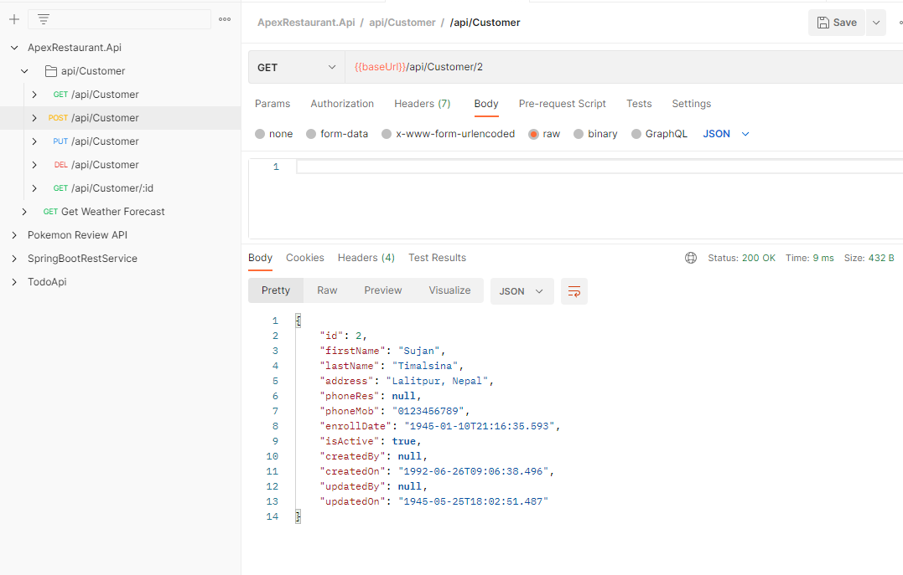

<h1 align="center"> ApexRestaurant </h1>
<h2 align="center"> Using Dotnet 7 </h2>

## CRUD Operations Showcased using Postman

> ### 1. POST REQUEST

> ### 2. PUT REQUEST

> ### 3. GET REQUEST

> ### 4. GET REQUEST WITH ID 

> ### 5. DELETE REQUEST

> ### 6. SWAGGER UI

